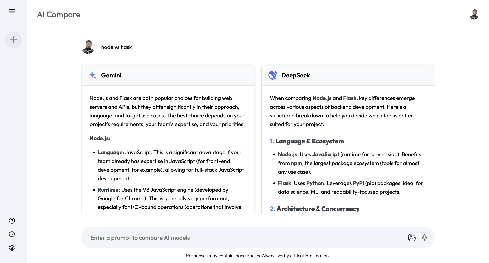

# AI Compare 🤖⚖️

**AI Compare** is a sleek React web application that allows users to **compare the outputs of different AI models side-by-side**. Simply enter a prompt, and see how each model responds — ideal for research, evaluation, or general curiosity about how AI models handle the same input differently.



## ✨ Features

- 🔍 Compare responses from multiple LLMs (e.g., Gemini, DeepSeek)
- 💬 Simple input interface to prompt models
- 🧠 Structured layout for easy content comparison
- ⚙️ Scalable architecture to add more models easily
- 🧑‍🎨 Clean and modern UI with intuitive interaction

## 🚀 Getting Started

### Prerequisites

Ensure you have the following installed:

- Node.js `>=18.x`
- Yarn or npm

### Installation

```bash
git clone https://github.com/your-username/ai-compare.git
cd ai-compare
npm install
# or
yarn
